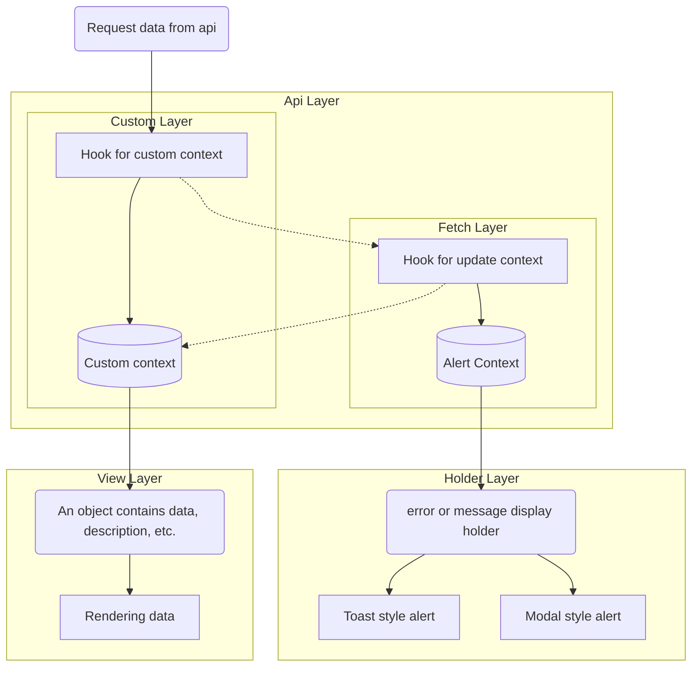

# Description

## Overall design

For api module, consider use 

```mermaid
flowchart TD
	subgraph Api Layer
		subgraph Fetch Layer
			fetch-hook[Hook for update context] --> alert-context[(Alert Context)]
		end
		subgraph Custom Layer
			custom-hook[Hook for custom context] --> custom-context[(Custom context)]
			custom-hook -.-> fetch-hook
			fetch-hook -.-> custom-context
		end
	end
	subgraph Holder Layer
		direction TB
		overlay(error or message display holder)
		overlay --> toast[Toast style alert]
		overlay --> modal[Modal style alert]
	end
	subgraph View Layer
		custom(An object contains data, description, etc.) --> rendering[Rendering data]
	end
	request(Request data from api) --> custom-hook
	alert-context --> overlay
	custom-context --> custom
```
